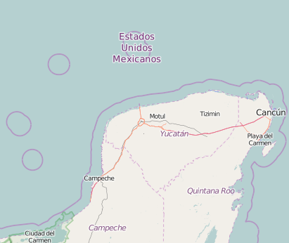

## P3: Wrangle OpenStreetMap Data: Yucatán Peninsula

In this project I analyze the OpenStreetMap data of the Yucatán Peninsula, perform automated data cleaning via python scripts, and import the data into a MongoDB instance which can be used for querying the data. The OpenStreetMap data is relatively sparse in the Yucatán region, so I chose to work with the larger region to fulfill the minimum data size requirement.

This is my submission for the third project of Udacity's Data Analyst program. All files related to this project are located in this GitHub directory. 

The grading rubric for the project can be found [here](https://docs.google.com/document/d/1TpfNxDzUjhibq9Qb8cOQHtlvZUelft-W0fb7pCTTyYE/pub).

View the .ipynb (iPython notebook) [here](Data_Analyst_ND_Project3.ipynb).

View the project as html [here](Data_Analyst_ND_Project3.html).
